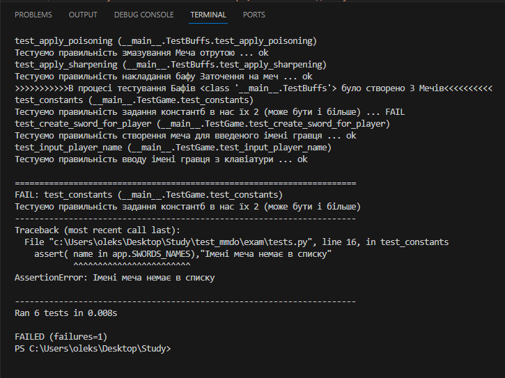
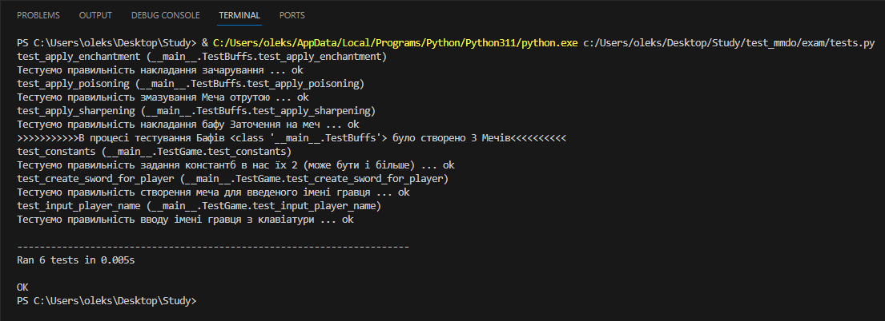

# Завдання 

У роботі №3, у файлі test.py модифікувати тест test_constants та зробити перевірку з неіснуючим іменем Меча 

Модифікований код тесту test_constants : 

```py
    def test_constants(self):
        """Тестуємо правильність задання константб в нас їх 2 (може бути і більше)"""
        name = "Кований Піднебінник"
        self.assertIsInstance(app.SWORDS_NAMES, list, "Імена мечів мають мітитись у списку!")
        assert( name in app.SWORDS_NAMES),"Імені меча немає в списку"
        self.assertIsInstance( name, str, "Назва меча не є стрічкою!")
        assert (len(name)< 50),"імя меча за довге"
        self.assertIsInstance(app.MAX_TURNS, (int, float))
```

Результат тестування з неправельним іменем: 



Результат тестування з правельним іменем: 

